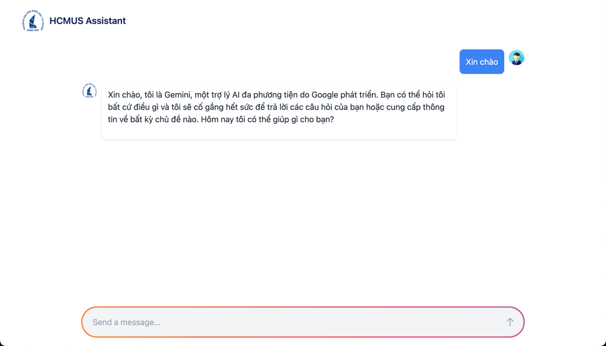

# Ho Chi Minh University Assistant

## Table of content

- [Introduction](#introduction)
- [Preview](#preview)

## Introduction

This project is a user-friendly chat interface built with Next.js, TypeScript, and Tailwind CSS. It serves as a front-end for the "University-Admission-Consulting-Chatbot" RAG system, which is available on GitHub at [here](https://github.com/PhuongBui712/University-Admission-Consulting-Chatbot.git). This chatbot provides comprehensive information and guidance to students seeking admission to universities.

This UI is integrated with LangServe to connect to a Retrieval Augmented Generation (RAG) system. This allows the chatbot to access and process information from a knowledge base, providing more comprehensive and accurate responses to user queries. The RAG system is powered by LangChain, a framework for building and deploying language models.

## Preview

